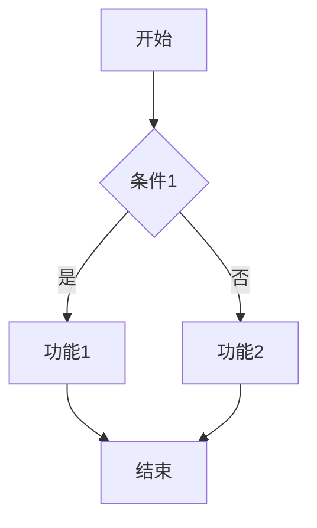

原始需求文档：留白，人工写入

# 背景
（描述当前需求的背景和问题）

# 核心业务规则
基于需求文档，列出核心业务规则，以列表形式给出，例如：
1. xxxx
2. xxxx
3. xxxx

此部分仅做摘要，不需要过于详细，后续会在功能需求中进行详细描述。

# 需求描述
基于核心业务规则，详细描述每个功能需求，分界点是功能，分别按照功能进行区分，例如：

## 功能1：xxxx
（描述功能1的具体需求和实现细节）

## 功能2：xxxx
（描述功能2的具体需求和实现细节）

每个功能点中，需要给出对应的流程图，流程图可以使用 Mermaid 语法进行描述，例如：

# 需求方案
描述为解决上述需求，需要怎么做，需要列出具体的方案和步骤。

## 数据模型
描述为实现需求，需要设计的数据模型，包括数据表结构、字段定义等，以及各字段的含义和可选值。

## 功能1：xxxx
描述功能1的实现方案，包括技术选型、架构设计等。

需要给出流程图，流程图可以使用 Mermaid 语法进行描述。

## 功能2：xxxx
描述功能2的实现方案，包括技术选型、架构设计等。

需要给出流程图，流程图可以使用 Mermaid 语法进行描述。

# 埋点信息
描述为实现需求，需要埋点的具体信息，包括埋点事件、属性定义等。

以表格的形式给出，例如：
| 埋点事件 | 属性名称 | 属性类型 | 备注 |
| --- | --- | --- | --- |
| 事件1 | 属性1 | 类型1 | 备注1 |
| 事件2 | 属性2 | 类型2 | 备注2 |

需要解释各埋点的作用、属性的作用和触发时机，尽可能精简。

# 验收点
描述为实现需求，需要满足的验收点，包括功能验收、性能验收等。以列表形式给出，例如：
1. 功能验收点1
2. 功能验收点2
3. 性能验收点1
4. 性能验收点2

# 其他说明
一些不确定或者界限不清晰的需求，可以放在这里进行说明，例如：
- 需求1：xxxx（描述需求1的具体内容和不确定性）
- 需求2：xxxx（描述需求2的具体内容和不确定性）
