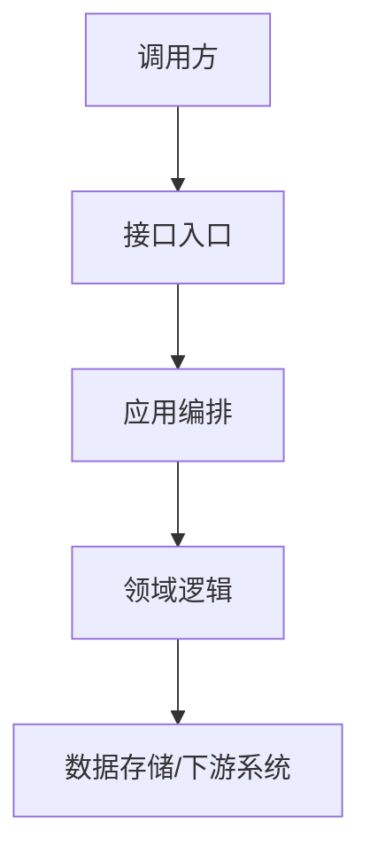

# 原始输入

- 需求名称：
- 需求来源：
- 原始 PRD / 需求链接：
- 原始需求摘要：
- 已知约束：
- 关联系统 / 模块：

# 方案目标

## 本次要解决的问题
- 问题1：xxxx
- 问题2：xxxx

## 成功标准
- 标准1：xxxx
- 标准2：xxxx

# 范围说明

## 本次范围
- 范围1：xxxx
- 范围2：xxxx

## 非本次范围
- 非范围1：xxxx
- 非范围2：xxxx

# 现状与改造点

## 现状说明
描述当前系统、流程、接口或数据结构的现状，说明为什么需要本次改造。

## 改造点总览
| 类型 | 名称 | 说明 | 影响范围 |
| --- | --- | --- | --- |
| 新增 / 修改 / 删除 | xxxx | xxxx | xxxx |

# 总体实现方案

## 方案概述
从架构、模块职责、上下游交互角度描述整体方案，避免泛化表述，重点说明如何落到代码实现。

## 系统交互图
需要时使用 Mermaid 描述系统间交互或主流程，图示应只保留实现相关信息。

# 详细实现

## 功能1：xxxx

### 目标
说明这个功能点要完成的业务目标。

### 入口与触发条件
- 入口类型：RPC / HTTP / MQ / 定时任务 / 其他
- 触发条件：xxxx
- 前置校验：xxxx

### 核心流程
1. 步骤1：xxxx
2. 步骤2：xxxx
3. 步骤3：xxxx

### 异常与边界处理
- 异常场景1：xxxx
- 异常场景2：xxxx
- 边界条件：xxxx

### 状态变化
描述关键状态、字段、对象或流程节点如何变化。

### 幂等 / 并发 / 事务要求
- 幂等要求：xxxx
- 并发控制：xxxx
- 事务边界：xxxx

### 关键实现要点
- 实现要点1：xxxx
- 实现要点2：xxxx

### 影响模块
| 模块 | 层级 | 改动类型 | 说明 |
| --- | --- | --- | --- |
| xxxx | facade / application / domain / repository / infra | 新增 / 修改 | xxxx |

## 功能2：xxxx
按功能1的结构继续补充。

# 代码落点

要求尽量明确到模块、层级、类或文件；如果暂时无法确定类名，至少明确到目录或包级别。

| 模块 | 层级 | 类 / 文件 / 目录 | 改动类型 | 职责说明 | 依赖关系 |
| --- | --- | --- | --- | --- | --- |
| xxxx | facade / application / domain / repository / infra | xxxx | 新增 / 修改 / 删除 | xxxx | xxxx |

# 接口设计

## 接口1：xxxx

### 接口说明
- 接口用途：xxxx
- 调用方：xxxx
- 被调用方：xxxx

### 入参
| 字段 | 类型 | 必填 | 含义 | 取值 / 校验规则 |
| --- | --- | --- | --- | --- |
| xxxx | xxxx | 是 / 否 | xxxx | xxxx |

### 出参
| 字段 | 类型 | 含义 | 说明 |
| --- | --- | --- | --- |
| xxxx | xxxx | xxxx | xxxx |

### 错误码 / 错误场景
| 错误码 | 场景 | 处理方式 |
| --- | --- | --- |
| xxxx | xxxx | xxxx |

# 数据模型与存储变更

## 数据结构变更
| 类型 | 名称 | 改动类型 | 说明 | 兼容性要求 |
| --- | --- | --- | --- | --- |
| 表 / 字段 / 索引 / 枚举 / 配置 | xxxx | 新增 / 修改 / 删除 | xxxx | xxxx |

## 数据流转
描述关键数据从输入到存储再到下游消费的流转路径。

## 数据迁移 / 回填 / 灰度
- 是否需要历史数据迁移：是 / 否
- 是否需要回填：是 / 否
- 灰度方案：xxxx

# 任务拆解

任务应能直接分派给 AI 或工程实现，每个任务都要有明确产出和完成标准。

| 任务 | 目标 | 主要改动 | 依赖 | 产出物 | 完成标准 |
| --- | --- | --- | --- | --- | --- |
| 任务1 | xxxx | xxxx | xxxx | xxxx | xxxx |
| 任务2 | xxxx | xxxx | xxxx | xxxx | xxxx |

# 测试与验收

## 单元测试
- 测试点1：xxxx
- 测试点2：xxxx

## 集成测试
- 测试点1：xxxx
- 测试点2：xxxx

## 回归测试
- 回归范围：xxxx

## 验收标准
- 验收点1：xxxx
- 验收点2：xxxx

# 风险与待确认项

- 风险1：xxxx
- 风险2：xxxx
- 待确认项1：xxxx
- 待确认项2：xxxx
